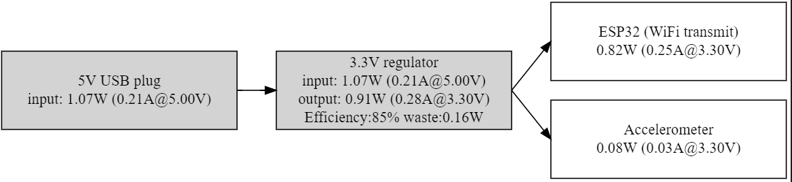

# Power Tree Generator

Here is a small tool to generate a power usage tree for your electronics circuit design from a JSON description.


If you're designing a circuit board with more than just a few components, it can get frustrating to manually calculate how much power each component uses, and how much load is expected on the board power supplies. Furthermore, when you're making a new design, you might want to sketch out a few different designs to see if you can get away with simple linear regulators, or if you'll need more complex DC-DC coverters, etc. There are fancier tools such as [PowerCad](https://www.analog.com/en/design-center/ltpowercad.html), but they can be overkill for small designs.

# Requirements

You'll need some version of Python 3, and GraphViz. If you're using [Visual Studio Code](https://code.visualstudio.com/), you can get everything you need with the [Graphiz](https://marketplace.visualstudio.com/items?itemName=joaompinto.vscode-graphviz) and [Python](https://marketplace.visualstudio.com/items?itemName=ms-python.python).

If you're using Ubuntu/Debian, try 'sudo apt install graphviz python3'

# Example Usage

The tool accepts a JSON file as an input. For example, here's a JSON file for a small board, that is powered by a 5V USB plug, and has a single linear voltage regulator, which powers two modules:

```
{
    "type": "powersupply",
    "name": "5V USB plug",
    "voltage": 5,
    "loads" : [
        {
            "type": "linear",
            "name": "3.3V regulator",
            "voltage": 3.3,
            "loads": [
                {
                    "type": "load",
                    "name": "ESP32 (WiFi transmit)",
                    "max_current": 0.25
                },
                {
                    "type": "load",
                    "name": "Accelerometer",
                    "max_current": 0.02
                }
            ]
        }
    ]
}
```

The board description is organized as a series of nested objects. The top-level one should always be a 'powersupply', which represents power coming from some external source. The power supply then can have one or more things powered by it, which are either voltage regulators ('linear' or 'dcdc'), or things that you want to power ('loads').

For this example, I want to know the worst-case power usage of the board, so I looked at the ESP32 datasheet and saw that the maximum current it will draw is 0.25A when it is transmitting on WiFi, and the accelerometer draws .02A when making a sample. You could also input an 'average' current draw here, to evaluate the normal use case.

Save these contents into a file called 'example.json', then run power.py to generate a dot file, then dot to actually make the diagram. Alternatively, if you're using VSCode, open power.py, press F5 to run the tool, then open example.dot, and press ctrl+shift+v to render a preview. Either way, you should get a diagram similar to this:


The tool automatically makes a block diagram with arrows to show connectivity, and also calculates the power usage at every node, as well as the power loss in the regulator. Note that it doesn't model more complex things such as loss along a wire, etc; it's just for getting a ballpark estimate of the power use.

Also notice that it automatically calculated the efficiency and power loss in the linear regulator. It does this by assuming the regulator is a perfect linear regulator, and only loses power from the difference between the input and output voltages.

That's probably fine for this system, since it's powered by the wall. If we wanted more efficiency, we could try to replace the linear regulator with a cheap DC-DC buck converter. In this case, we have to specify the efficiency of the buck converter:

```
{
    "type": "powersupply",
    "name": "5V USB plug",
    "voltage": 5,
    "loads" : [
        {
            "type": "dcdc",
            "name": "3.3V regulator",
            "efficiency": 0.85,
            "voltage": 3.3,
            "loads": [
                {
                    "type": "load",
                    "name": "ESP32 (WiFi transmit)",
                    "max_current": 0.25
                },
                {
                    "type": "load",
                    "name": "Accelerometer",
                    "max_current": 0.025
                }
            ]
        }
    ]
}
```

which gives this result:



It's better, but 70mA is not very significiant for a wall-powered device, so it's probably not worth doing. If it were battey powered, though, it might be worth replacing the linear regulator with a more efficeint buck converter.

# Real use case

Here's a description for a more complicated board:
```
{
    "type": "powersupply",
    "name": "5V wall wart",
    "voltage": 5,
    "loads" : [
        {
            "type": "dcdc",
            "name": "12V supply for control boards",
            "voltage": 12,
            "efficiency": 0.85,
            "loads": [
                {
                    "type": "load",
                    "name": "button controller",
                    "max_current": 0.1
                }
            ]
        },
        {
            "type": "load",
            "name": "LED buffer",
            "max_current": 0.05
        },
        {
            "type": "linear",
            "name": "3.3V linear supply",
            "voltage": 3.3,
            "loads" : [
                {
                    "type": "load",
                    "name": "ESP32, BLE enabled",
                    "max_current": 0.25
                },
                {
                    "type": "load",
                    "name": "microSD card, writing",
                    "max_current": 0.2
                },
                {
                    "type": "load",
                    "name": "FPGA IO pins",
                    "max_current": 0.05
                },
                {
                    "type": "load",
                    "name": "RS422 transceiver, short condition",
                    "max_current": 0.4
                },
                {
                    "type": "linear",
                    "name": "1.2V linear supply",
                    "voltage": 1.2,
                    "loads" : [
                        {
                            "type": "load",
                            "name": "FPGA core",
                            "max_current": 0.2
                        }
                    ]
                }
            ]
        }
    ]
}
```

Which gives us this board:


This board was initially designed with the assumption that the ESP would not have a radio enabled, and without considering the worst-case power usage of the RS422 transmitter. Unfortunately, as designed now, the 3.3V supply likely has too big of a load, and should be replaced with a dc-dc converter. As above, that can be done by modifying a power supply definition:

```
            "type": "dcdc",
            "name": "3.3V supply",
            "voltage": 3.3,
            "efficiency": 0.9,
            "loads" : [
```

This brings down the waste power significantly, and should result in the board being more stable.

