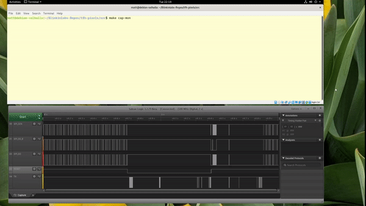

# Integrate your Saleae logic analyzer into your build process.

The Saleae logic analyzer is quite convenient for debugging your embedded design, but when you're hours into hunting down a bug, manually clicking start just before you load new code onto your device gets old. There's a simple way around this! The Logic 1.2.29 software has a simple remote control interface, complete with a convenient Python library to interface with it. You *could* use this to perform automated testing, but let's start with just automating our debugging a little.

## Requirements:
* Saleae logic analyzer
* [Logic 1.2.29](https://support.saleae.com/logic-software/legacy-software/older-software-releases)

## Guide

1. Install Logic 1.2.29 (or the newer 2.x version once scripting is added back in), and run it.
2. Connect your logic analyzer to your computer, and to your dev board.
3. Configure logic with appropriate capture settings (note: if you often use the same settings, you can either save the setup in Logic, or use the Python scripting interface to recreate it automatically).
4. Enable the scripting interface in Logic by choosing Options->Preferences, then the 'Developer' tab, and make sure 'Enable scripting socket server' is enabled, and the port is set to the default 10429.
5. Run the 'capture.py' script to verify that the capture is triggered as expected.
6. Add the capture script to your build system, to automatically start a capture whenever new firmware is updated (or whenever else is appropriate). An example Makefile for ESP-IDF 3.3 is provided as an example; you can use the 'make cap-mon' target to start a capture, then reset the esp32, and view the console log.
7. Optional: if your device has a serial output, you can capture it along with the signals you are looking at for a quick&rudimentary way to correlate events to code.
